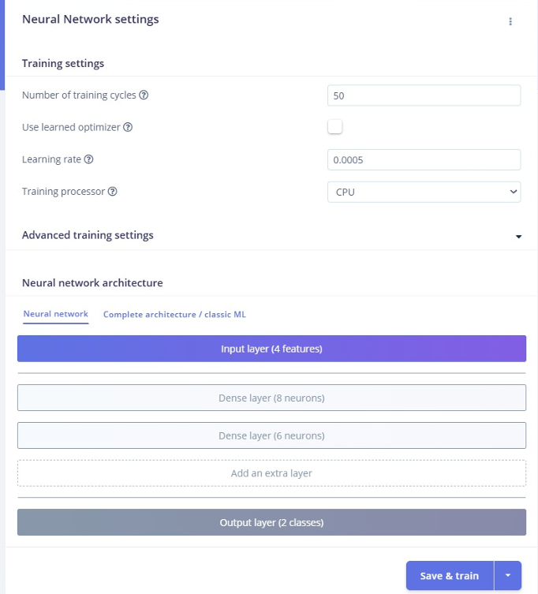

# Embedded Focus Monitoring System

Embedded AI focus-state monitoring system using Arduino Nano 33 BLE Sense and Edge Impulse.

  

---

# Overview

This project implements a real-time embedded focus monitoring system using physiological and motion-based sensor data.

The system combines:
- Pulse sensor readings
- IMU motion analysis
- Embedded machine learning
- Real-time classification
- Live monitoring interface

The model was trained using Edge Impulse and deployed directly onto the embedded hardware platform.

---

# Sensor Feature Extraction

  

The system extracts features from:
- Pulse sensor activity
- Desk vibration and movement
- IMU acceleration changes

These features are used to classify user focus state in real time.

---

# Feature Visualization

  

Feature separation was analyzed using Edge Impulse to distinguish:
- Focused states
- Distracted states

---

# Model Training

  

The neural network model was trained and optimized for embedded deployment on Arduino hardware.

---

# Features

- Real-time focus-state classification
- Embedded AI inference
- Pulse + IMU sensor fusion
- Arduino deployment
- Live monitoring output
- Lightweight embedded model

---

# Hardware Platform

- Arduino Nano 33 BLE Sense Rev2
- Pulse Sensor
- Embedded IMU
- Edge Impulse

---

# Technologies Used

- Arduino
- C++
- Edge Impulse
- Embedded AI
- IMU Sensors
- Pulse Sensors

---

# Results

| Metric | Result |
|---|---|
| Deployment Platform | Arduino Nano 33 BLE Sense |
| Sensors | Pulse + IMU |
| Classification | Focused vs Distracted |
| Inference | Real-time embedded execution |

---

# Future Work

- Improved classification accuracy
- Expanded sensor fusion
- Mobile dashboard integration
- Longer-term activity analysis

---

# Documentation

- [Full Technical Report](docs/embedded_focus_monitor_report.pdf)

---

# Authors

Hasan Al Hussein  
Khalifa University
